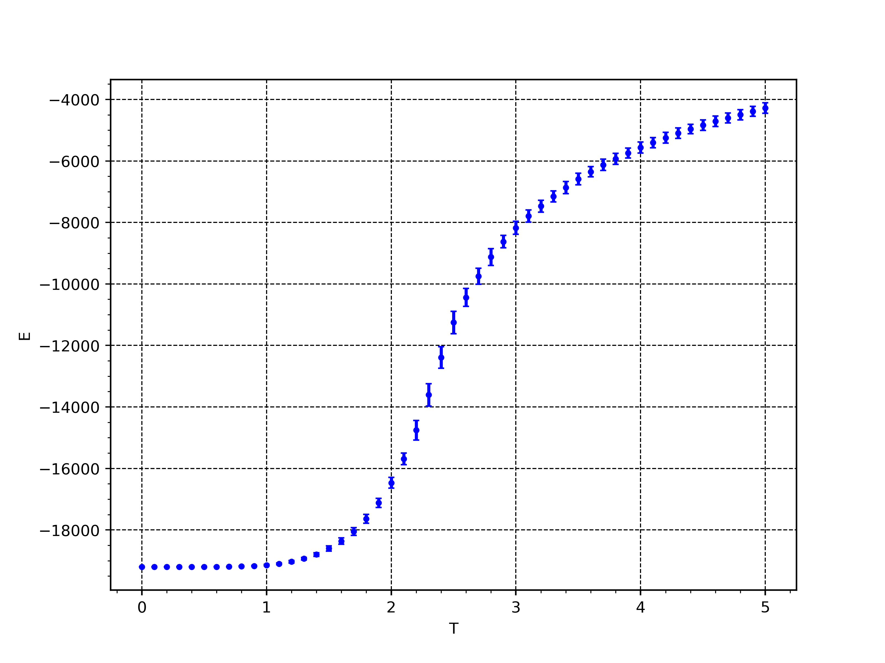
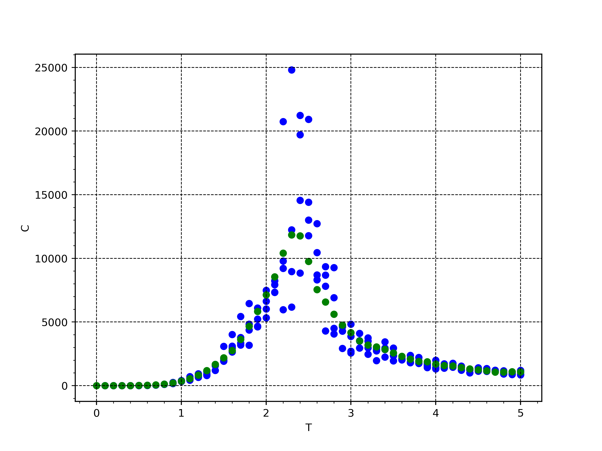
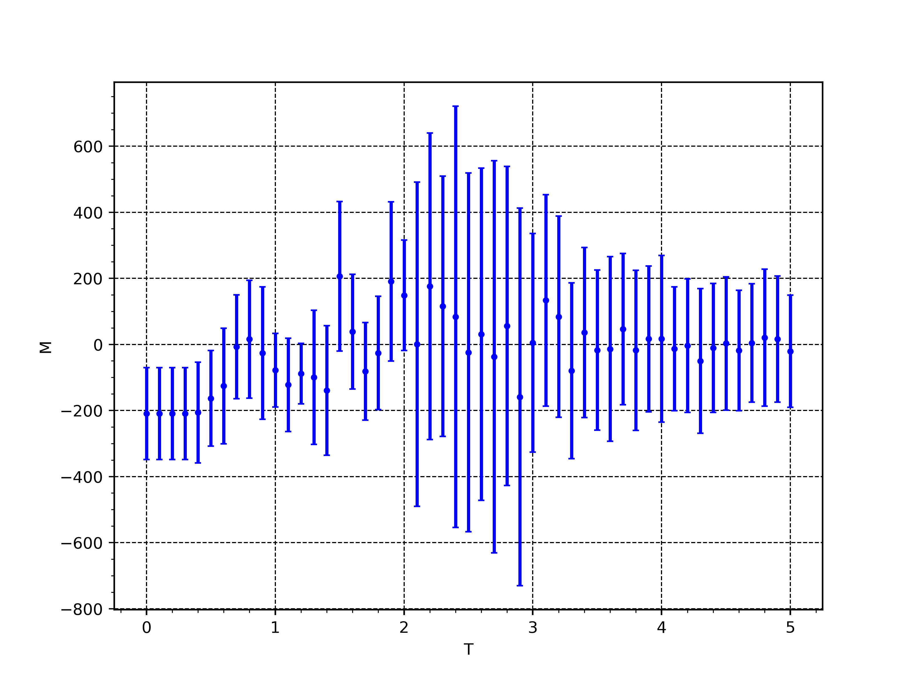
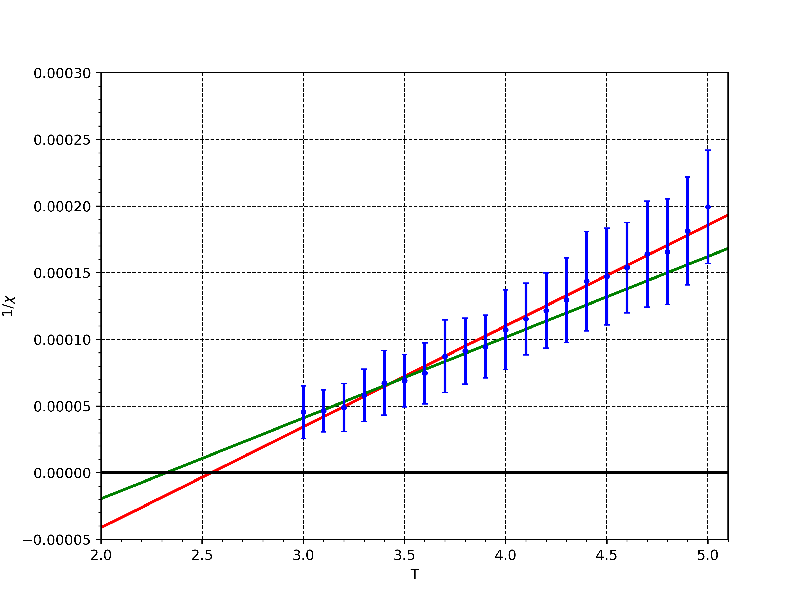

# Задание 1. Модель Изинга
## Зависимости
1) meson >= 1.4.0
2) возможно, придется еще установить ninja
2) компилятор языка Vala (наверняка есть в репозиториях вашего дистрибутива, точно есть в репозиториях conda)
3) g-ir-compiler (пакет должен иметь название вроде gobject-introspection)
4) [PyGObject](https://pygobject.gnome.org/)

## Компиляция
```
$ meson build && ninja -C build       # компиляция
$ . ./add-ld-gi-pathes.sh             # добавляет пути к $LD_LIBRARY_PATH и $GI_TYPELIB_PATH
```

## Использование
Функция `ising(temperature, grid_size, ncycles)` находится в модуле `python/ising.py`

## Результаты
Зависимость энергии от температуры для системы с линейным размером 100,
4-х различных сидов генератора случайных чисел. Значение усреднено по 1 миллиону шагов.
В начальном положении верхняя половина сетки имеет спин +1, а нижняя -1.



Теплоемкость для тех же запусков. Синие значения рассчитаны по дисперсии энергии, зеленые - по производной энергии.



Магнитный момент для тех же запусков



Теплоемкость от температуры для той же системы для 100 различных сидов и 1 миллиона шагов. Одна синяя точка соответствует темплоемкости, полученной по дисперсии энергии для одного расчета, красные точки усредняют синие, зеленые получены по производной энергии по температуре.


Обратная магнитная восприимчивость от температуры для тех же систем для 100 различных сидов. Красная прямая проведена по всем точкам, зеленая - по первым десяти. Точки хорошо лежат на прямых, пересечение с осью абсцисс близко к критической температуре.



