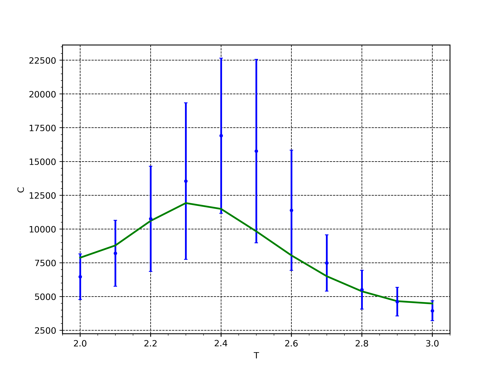

# Задание 1. Модель Изинга
## Зависимости
1) meson >= 1.4.0
2) возможно, придется еще установить ninja
2) компилятор языка Vala (наверняка есть в репозиториях вашего дистрибутива, точно есть в репозиториях conda)
3) g-ir-compiler (пакет должен иметь название вроде gobject-introspection)
4) [PyGObject](https://pygobject.gnome.org/)
5) numpy
6) pandas

## Компиляция
```
$ meson build && ninja -C build       # компиляция
$ . ./add-ld-gi-pathes.sh             # добавляет пути к $LD_LIBRARY_PATH и $GI_TYPELIB_PATH
```

## Использование
Функция `ising(temperature, grid_size, ncycles)` находится в модуле `python/ising.py`

## Результаты
Для всех рассчетов начальная система одна и та же: линейный размер 100,
верхняя половина системы имеет спин +1, нижняя -1. Во всех расчетах сначала пропускается 200 тысяч шагов, потом
искомые параметры вычисляются по 1 миллиону шагов.

Зависимость энергии от температуры для 4 различных сидов генератора случайных чисел


Теплоемкость для тех же запусков. Синие значения рассчитаны по дисперсии энергии, зеленые - по производной энергии.


Магнитный момент для тех же запусков


Теплоемкость от температуры для 100 различных сидов. Синие значения построены для дисперсии энергии, зеленые - по производной энергии, усредненной по всем расчетам



Обратная магнитная восприимчивость от температуры для 100 различных сидов. Красная прямая проведена по всем точкам, зеленая - по первым десяти. Точки хорошо лежат на прямых, пересечение с осью абсцисс близко к критической температуре.


Из графика теплоемкости следует, что критическая температура лежит в интервале (2.2; 2.5).
Прямые на графике обратной магнитной восприимчивости пересекают ось абсцисс в точках, лежащих
в этом интервале.
